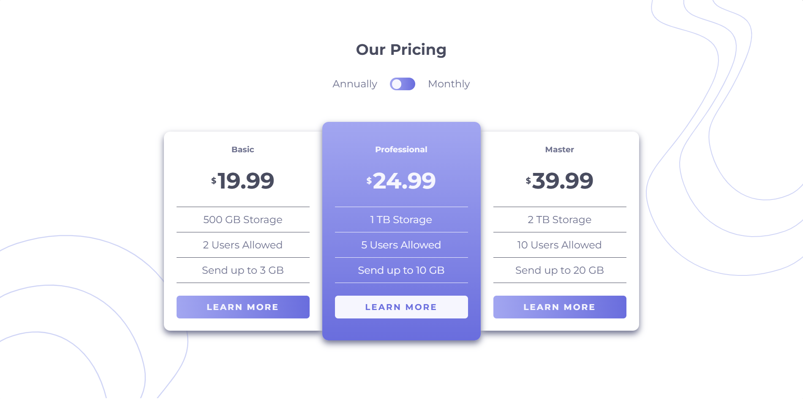

# Frontend Mentor - Pricing component with toggle solution

This is my solution to the [Pricing component with toggle challenge on Frontend Mentor](https://www.frontendmentor.io/challenges/pricing-component-with-toggle-8vPwRMIC). Frontend Mentor challenges help you improve your coding skills by building realistic projects.

## Table of contents

- [Overview](#overview)
  - [The challenge](#the-challenge)
  - [Screenshot](#screenshot)
  - [Links](#links)
- [My process](#my-process)
  - [Built with](#built-with)
  - [What I learned](#what-i-learned)
  - [Continued development](#continued-development)
  - [Useful resources](#useful-resources)
  - [AI Collaboration](#ai-collaboration)
- [Author](#author)

## Overview

### The challenge

Users should be able to:

- View the optimal layout for the component depending on their device's screen size
- Control the toggle with both their mouse/trackpad and their keyboard
- **Bonus**: Complete the challenge with just HTML and CSS

### Screenshot

### Links

- Solution URL: [Add solution URL here](https://your-solution-url.com)
- Live Site URL: [Add live site URL here](https://your-live-site-url.com)

## My process

### Built with

- Semantic HTML5 markup
- CSS custom properties
- Flexbox
- CSS Grid
- Mobile-first workflow
- [React](https://reactjs.org/) - JS library

### What I learned

- Improved my understanding of React state management using the `useState` hook.
- Learned how to dynamically render components using the `map()` function with JSON data.
- Practiced conditional rendering to switch between annual and monthly pricing.
- Built a custom pricing toggle using controlled components in React.
- Improved my debugging skills using `console.log()` and browser DevTools.
- Learned how to position decorative background patterns without causing page overflow issues.
- Practiced building responsive layouts using CSS Grid, CSS Flexbox, and media queries.
- Gained a better understanding of absolute positioning, fixed positioning, and layering with `z-index`.

### Continued development

- I want to continue improving my React component architecture and code organization.
- I plan to practice more state-driven UI interactions in React projects.
- I want to deepen my understanding of responsive design techniques for different screen sizes.
- I aim to improve my CSS positioning and layout skills, especially with complex UI designs.
- I want to become more confident with debugging frontend issues systematically.
- I also want to learn more about accessibility and writing cleaner, reusable components.

### Useful resources

- [Frontend Mentor](https://www.frontendmentor.io/challenges/pricing-component-with-toggle-8vPwRMIC) - provided me with the resources and styles to guide and help me build the project.

### AI Collaboration

### AI collaboration

I used AI as a learning assistant throughout this project to better understand React state management, controlled components, conditional rendering, and CSS positioning techniques.

Instead of copying complete solutions, I focused on understanding the reasoning behind the guidance provided. This helped me improve my debugging process, especially when working with custom toggle interactions and decorative background positioning without causing layout overflow.

## Author

- Website - [Add your name here](https://www.your-site.com)
- Frontend Mentor - [@yourusername](https://www.frontendmentor.io/profile/yourusername)
- Twitter - [@yourusername](https://www.twitter.com/yourusername)
